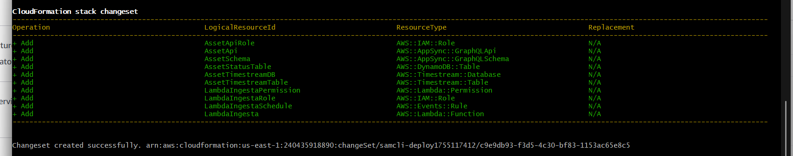

# Microservicio ingesta

## Hacer push desde EC2

1. Crear una clave SSH
    ```
    ssh-keygen -t ed25519 -C "eficiencia.desarrollo@copower.com.co"
    ```
2. Copiar clave generada `cat ~/.ssh/id_ed25519.pub`

3. En github agregar la clave `→ Settings → SSH and GPG keys`

4. Cambiar la configuracion del remote
    ```
    git remote set-url origin git@github.com:CathaleIA/microservices-catha.git
    ```
5. Tener permisos de GIT `sudo chown -R ec2-user:ec2-user .`


## Desplegar en AWS
1. Clone repositorio en EC2
1. Cree un contenedor con la imagen que estaba en el EC2 `desploy-merge` (No tengo claro esta imagen).
    ```
    [ec2-user@ip-172-31-84-48 microservices-catha]$ docker run -it --rm --privileged -v ~/.aws:/home/ec2-user/.aws:ro -v $(pwd):/home/ec2-user/app -v /var/run/docker.sock:/var/run/docker.sock -v /usr/bin/docker:/usr/bin/docker -v /etc/docker:/etc/docker --group-add $(stat -c '%g' /var/run/docker.sock) -u root deploy-merge
    ```
1. Libreria para firmar solicitudes a appsync con IAM, se instalo desde EC2 en la raiz del proyecto, cuando se hace sam build el lee los archivos.
    ```
    pip install requests requests-aws4auth -t IngestaService/
    ```

1. Estrcutura de carpetas:
    ```
    ingestadata/
    ├── IngestaService/
    │   ├── lambda_ingesta.py
    │   └── requirements.txt
    ├── QueryService/
    │   ├── lambda_query.py
    │   └── requirements.txt
    ├── template.yaml
    ```
1. Comando para desplegar:  
    ```
    sam build
    sam deploy
    ``` 
    

## Conexion con AWS. Mediante Apollo.

1. Instalar dependencias 
    ```
    npm install @apollo/client aws-appsync-auth-link aws-appsync-subscription-link graphql
    ```

1. Agregar varibales de entorno `.env`
    ```
    NEXT_PUBLIC_APPSYNC_API_URL=https://ebvdnffnqbe3bfylubwf4mcfy4.appsync-api.us-east-1.amazonaws.com/graphql
    NEXT_PUBLIC_APPSYNC_WS_URL=wss://ebvdnffnqbe3bfylubwf4mcfy4.appsync-realtime-api.us-east-1.amazonaws.com/graphql
    ```

1. Documentacion oficial
    1. [Building a real-time WebSocket client in AWS AppSync](https://docs.aws.amazon.com/appsync/latest/devguide/real-time-websocket-client.html)

    1. [Opciones para conectar Nextj con Appsync, libreria final actualizada](https://docs.amplify.aws/gen1/nextjs/prev/build-a-backend/graphqlapi/upgrade-guide/)

    

## Halar data de APIFAKE


## Conexion de snowflake con AWS

1. Link: https://docs.snowflake.com/en/user-guide/python-connector-install.html

1. Se guardaron las credenciales de acceso a AWS en Secrets Manager de AWS.